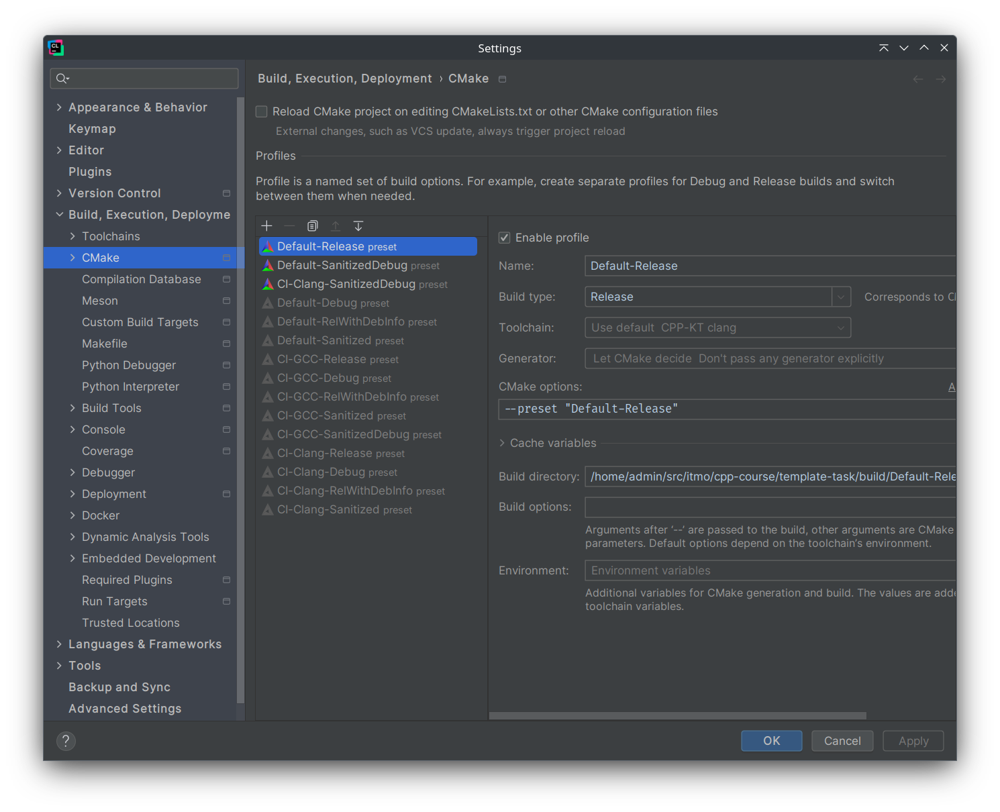

# CLion

Рекомендуется пользоваться EAP версией, ибо именно в ней все свежие фиксы и фичи.

## [Установка](https://www.jetbrains.com/help/clion/installation-guide.html)
На официальном сайте (ссылка в header-e - кликабельна) можно найти информацию об установке через *Toolbox* (если вы используете другие IDE от Jetbrains) или об установке на __Windows__. 

На __Ubuntu__ альтернативно доступна установка через `snap`, если вы хотите обновлять среду разработки через пакетный менеджер:
```console
$ sudo apt install snap
$ sudo snap install clion --classic
```

## [clang-tidy](https://www.jetbrains.com/help/clion/clang-tidy-checks-support.html)
__Clion__ имеет встроенный *clang-tidy*, но вы можете указать внешний, если он есть на вашей системе.

> Нужно убедиться, что вы поставили галочку на `Prefer .clang-tidy files over IDE settings` чтобы использовать __.clang-tidy__ курса.

Path: `Settings / Preferences | Editor | Inspections - C/C++, General, Clang-Tidy`


## [clang-format](https://www.jetbrains.com/help/clion/clangformat-as-alternative-formatter.html)

__Clion__ имеет встроенный (альтернативный) *clang-format*, но вы можете указать внешний, если он есть на вашей системе.

> Нужно убедиться, что вы поставили галочку на `Enable ClangFormat (only for C/C++/Objective-C` чтобы использовать __.clang-format__ курса.

Path: `Settings / Preferences | Editor | Code Style - ClangFormat`


Либо другой, более быстрый вариант. В нижней панели экрана, поставить соотвествующую галочку.


## Интеграция с CMake presets

При первом открытии проекта, содержащего файл `CMakePresets.json`, CLion сгенерирует вам профили сборки и предложит активировать нужные.

Текущий профиль далее выбирается в правом верхнем углу, возле списка конфигураций запуска.

На момент написания профили делятся на:

1. Непосредственно использующиеся для сборки в рамках CI &mdash; такие обычно обозначены префиксом `CI-`. С их помощью можно максимально приблизиться к сборке в GitHub, но такие пресеты ожидают конкретную версию конкретного компилятора. Лучше всего их использовать в сочетании с [нашими Docker-контейнерами](https://github.com/CPP-KT/containers).
2. Упрощённые и оптимизированные под запуск на широком спектре систем &mdash; такие обычно обозначены префиксом `Default-`. Они подойдут, чтобы без дополнительных сложностей собрать и запустить тесты, но в них используется урезанное множество опций компиляции/линковки по сравнению с первыми.

Если в какой-то момент вы захотите активировать или деактивировать какие-то профили, это можно сделать в `File`->`Settings`->`Build,Execution...`->`CMake`.



Если после добавления конфигураций CMake падает с ошибкой при попытке сконфигурироваться, и вы не понимаете, с чем она связана, есть следующие возможные шаги решения (применяйте до первого сработавшего):

1. `Tools`->`CMake`->`Reload CMake Project`;
2. `Tools`->`CMake`->`Reset Cache and Reload Project`;
3. Удалить директорию `build` (и `cmake-build-*`, если такие есть), после чего повторить п.2;
4. Обратиться за помощью к преподавателям курса.

## Полезные ссылки
- [Выбор конфигурации сборки](https://intellij-support.jetbrains.com/hc/en-us/community/posts/360000919039-Clion-how-to-build-cmake-to-support-debug-release). Чем сборка в дебаге отличается от сборки в релизе, рассказывают [в 3 семестре на курсе операционных систем](https://youtu.be/LXdAN2f3KX0?list=PLd7QXkfmSY7akIHUbZ-zT9pG-G3zIGQBh).
- [Valgrind memcheck](https://www.jetbrains.com/help/clion/memory-profiling-with-valgrind.html): проверки утечек памяти и т.д.
