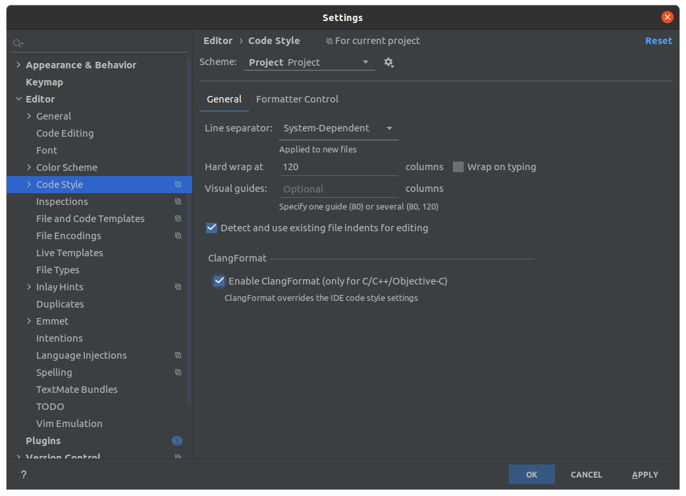
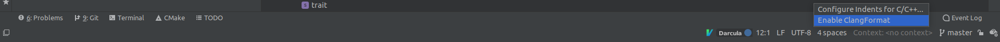
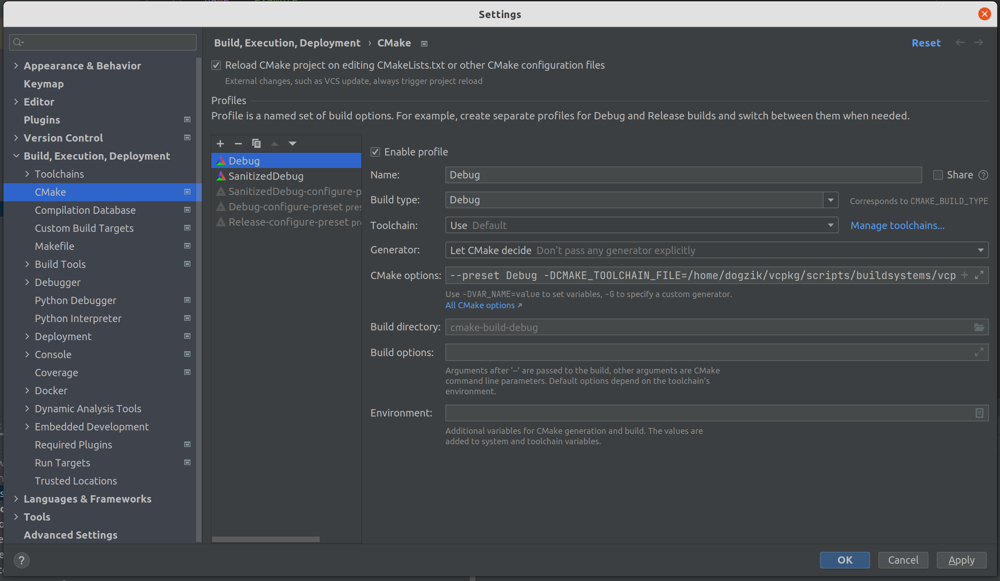

# CLion

Крайне рекомендуется пользоваться EAP версией, ибо имеено в ней все свежие фиксы и фичи.

## [Установка](https://www.jetbrains.com/help/clion/installation-guide.html)
На официальном сайте (ссылка в header-e - кликабельна) можно найти информацию об установке через *Toolbox* (если вы используете другие IDE от Jetbrains) или об установке на __Windows__. 

На __Ubuntu__ рекомендуется следующий процесс установки (чтобы можно было обновлять среду разработки через пакетный менеджер):
```console
$ sudo apt install snap
$ sudo snap install clion --classic
```

## [clang-tidy](https://www.jetbrains.com/help/clion/clang-tidy-checks-support.html)
__Clion__ имеет встроенный *clang-tidy*, но вы можете указать внешний, если он есть на вашей системе.

> Нужно убедиться, что вы поставили галочку на `Prefer .clang-tidy files over IDE settings` чтобы использовать __.clang-tidy__ курса.

Path: `Settings / Preferences | Editor | Inspections - C/C++, General, Clang-Tidy`


## [clang-format](https://www.jetbrains.com/help/clion/clangformat-as-alternative-formatter.html)

__Clion__ имеет встроенный (альтернативный) *clang-format*, но вы можете указать внешний, если он есть на вашей системе.

> Нужно убедиться, что вы поставили галочку на `Enable ClangFormat (only for C/C++/Objective-C` чтобы использовать __.clang-format__ курса.

Path: `Settings / Preferences | Editor | Code Style - ClangFormat`



Либо другой, более быстрый вариант. В нижней панели экрана, поставить соотвествующую галочку.


## Интеграция с vcpkg и CMake preets

Для начала нам нужно попасть в окно конфигурации CMake. Это происходит автоматически при первом открытии проекта или же можно найти в `File`->`Settings`->`Build,Execution...`->`CMake`



Для интеграции с vcpkg вне зависимости от сборки вам нужно в `CMake options` добавить `-DCMAKE_TOOLCHAIN_FILE=<path-to-vcpkg>/vcpkg/scripts/buildsystems/vcpkg.cmake`

Далее добавляем три основные конфигурации, каждый раз нажимая на плюсик для создания новой конфигурации:
* Debug
  * `Build type`: `Debug`
  * В `CMake options` добавляем `--preset Debug`
* Release
  * `Build type`: `Release`
  * В `CMake options` добавляем `--preset Release`
* SanitizedDebug
  * `Build type`: `Debug`
  * В `CMake options` добавляем `--preset SanitizedDebug`

Если после добавление конфигураций CMake падает с ошибкой при попытке сконфигурироваться, то нужно в каждой конфигурации указать в качестве `Build directory` папку вида `cmake-build-<configuration-name>`

## Полезные ссылки
- [Выбор конфигурации сборки](https://intellij-support.jetbrains.com/hc/en-us/community/posts/360000919039-Clion-how-to-build-cmake-to-support-debug-release). Чем сборка в дебаге отличается от сборки в релизе, рассказывают [в 3 семестре на курсе операционных систем](https://youtu.be/LXdAN2f3KX0?list=PLd7QXkfmSY7akIHUbZ-zT9pG-G3zIGQBh).
- [Valgrind memcheck](https://www.jetbrains.com/help/clion/memory-profiling-with-valgrind.html): проверки утечек памяти и т.д. 


